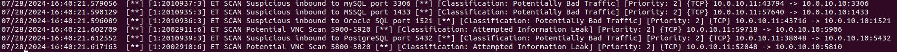
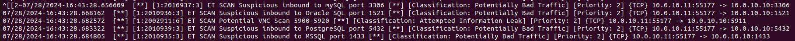
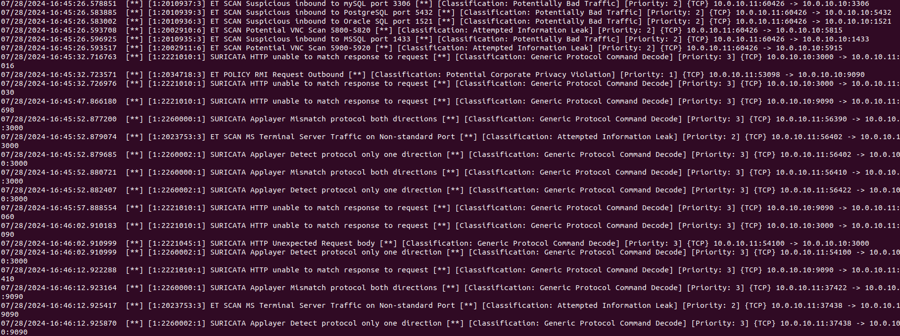
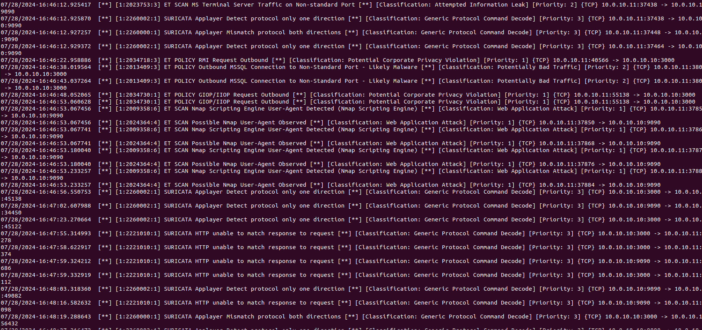
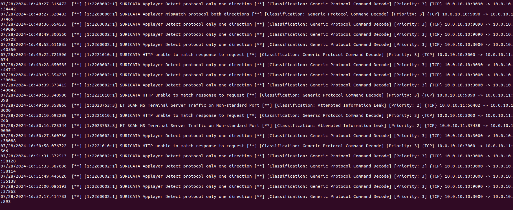
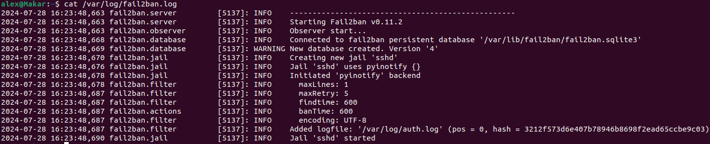
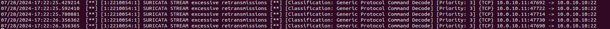
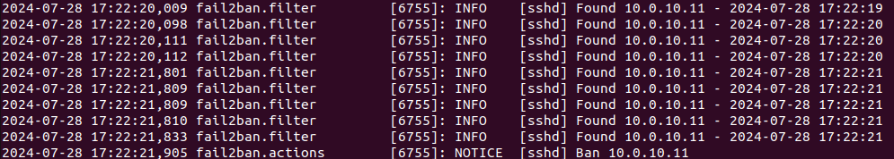

# Домашнее задание к занятию «Защита сети» "Макарцев Александр Владимирович"

### Подготовка к выполнению заданий

1. Подготовка защищаемой системы:

- установите **Suricata**,
- установите **Fail2Ban**.

2. Подготовка системы злоумышленника: установите **nmap** и **thc-hydra** либо скачайте и установите **Kali linux**.

Обе системы должны находится в одной подсети.

------

### Задание 1

Проведите разведку системы и определите, какие сетевые службы запущены на защищаемой системе:

**sudo nmap -sA < ip-адрес >**

**sudo nmap -sT < ip-адрес >**

**sudo nmap -sS < ip-адрес >**

**sudo nmap -sV < ip-адрес >**

По желанию можете поэкспериментировать с опциями: https://nmap.org/man/ru/man-briefoptions.html.


*В качестве ответа пришлите события, которые попали в логи Suricata и Fail2Ban, прокомментируйте результат.*

#### Решение
```
**sudo nmap -sA < ip-адрес >**
```
Suricata - пусто. Сканирование с помощью ACK не определяется
```
**sudo nmap -sT < ip-адрес >**
```

```
**sudo nmap -sS < ip-адрес >**
```

```
**sudo nmap -sV < ip-адрес >**
```




В Fail2ban пусто во всех случаях, так как не было попыток подключиться



------

### Задание 2

Проведите атаку на подбор пароля для службы SSH:

**hydra -L users.txt -P pass.txt < ip-адрес > ssh**

1. Настройка **hydra**: 
 
 - создайте два файла: **users.txt** и **pass.txt**;
 - в каждой строчке первого файла должны быть имена пользователей, второго — пароли. В нашем случае это могут быть случайные строки, но ради эксперимента можете добавить имя и пароль существующего пользователя.

Дополнительная информация по **hydra**: https://kali.tools/?p=1847.

2. Включение защиты SSH для Fail2Ban:

-  открыть файл /etc/fail2ban/jail.conf,
-  найти секцию **ssh**,
-  установить **enabled**  в **true**.

Дополнительная информация по **Fail2Ban**:https://putty.org.ru/articles/fail2ban-ssh.html.


*В качестве ответа пришлите события, которые попали в логи Suricata и Fail2Ban, прокомментируйте результат.*

#### Решение

Suricata увидела попытки подключения на порты



Fail2ban увидела попытки подключения и забросила хост в бан



Suricata интерпретировала попытки подключиться, как сканирование порта, возможно hydra проверяет порт, прежде чем сделать новое подключение. Fail2Ban увидел превышение максимального количества соединений и выдал бан. Бан блокирует новые подключения